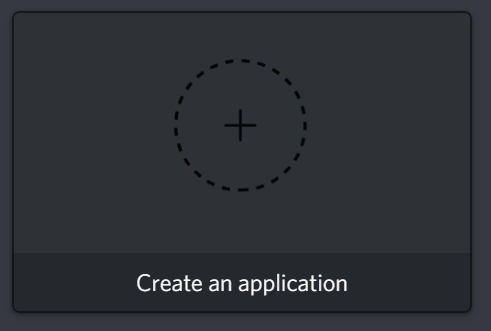

# How To Run The Battlefield V Stat Checker Bot 🧐
This guide will walk through all of the steps to get the bot up and running! If there are any questions feel free to ask. 😉

1. Go to [this](https://discordapp.com/developers/applications) website and log in with your Discord credentials  

2. Create an application by clicking on "Create an application".  

3. Enter an original name  

4. Do not forget to hit "Save Changes"!  

5. Navigate to "Bot" 🤖  

6. Click on "Add Bot"  

7. Discord will ask whether you are sure about what you are doing or not, click "Yes, do it!"  

8. Tadaa, you have succesfully created a bot! 🎉  

9. Now, to link the Battlefield V Stat Checker bot with your freshly made one you will have to get its Token, click here to reveal it
  
Discord will show you your bot's token, be sure to keep it save! If not, people can mess up your bot real good.  

10. When you boot up the Battlefield V Stat Checker and it is the first time, it will probably show you this screen  
  
No need to worry, you just need to enter your Bot Token here, just as shown in the image above, and hit return.  
After this it will either A. Complain about your token being wrong, or B. Run as intended.  
If it does C. feel free to open an issue right here: https://github.com/RobinCPel/Battlefield-V-Stat-Checker/issues and if I am not too busy with school or work I just might fix it. 😅  

11. This step is optional, if you did not enter your correct Bot Token you can do one of the two things. Delete the "bot-token.json" file and reboot the bot, or open the "bot-token.json" file and replace the wrong token with the correct one as shown below  
  

