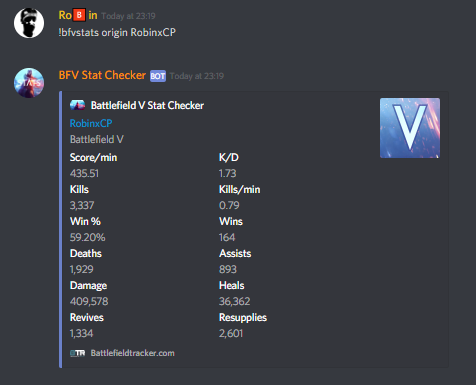

# Battlefield V Stat Checker - Discord Bot   
A Discord bot for requesting Battlefield V stats.

## About ✏
Battlefield V Stat Checker is a Discord bot written for me and my friends to show off our amazing Battlefield V skills in our Discord server!  
It is written 100% in Kotlin (if you exclude the Java libraries It's using), Kotlin is a relatively young language which you can get more info about [here](https://kotlinlang.org/).  
This bot heavily relies on the Discord4J library which can be found [here](https://discord4j.com/).

## Requirements ⚙
- Java 8 or newer
- A machine to run it on

## Before running the bot on your machine 💻
- Be sure to check all of the requirements listed above.
- Check out [this](HOW-TO-RUN.MD) tutorial on how to get this bot up and running on your own pc/server! 

## Recommendations 🧠
I would most certainly reccomend to run the bot on a device that's powered on 24/7, for example, I currently have a Raspberry Pi 3B at home which is hosting two Discord bots at the same time 24/7. The Raspberry Pi is a very small and affordable computer, you can find out more about it [here](https://www.raspberrypi.org/). 

## Adding the bot to your Discord server 🔑
You can use this shortcut to invite the bot to your Discord server, be sure to replace "CLIENT_ID_GOES_HERE" with your client ID!  
https://discordapp.com/oauth2/authorize?client_id=CLIENT_ID_GOES_HERE&scope=bot&permissions=514112

## The bot in action 🚀
 
 

## Releases 📚
The .jar files can be found [here](Releases). 

## Building the project yourself 🔨
The project is an _IntelliJ IDEA, Gradle, Java project with Kotlin support_. So if you open it with IntelliJ it should not be an issue to build it yourself. However, if you decide to do it without IntelliJ you still would need to have Kotlin and Gradle installed somehow, unfortunately I cannot help with this method since I have no experience with it.  
More about [IntelliJ IDEA](https://www.jetbrains.com/idea/), [Gradle](https://gradle.org/), [Java](https://www.java.com/) or [Kotlin](https://kotlinlang.org/).

## Sidenotes 📝
This Bot retrieves its data from [Battlefield Tracker](https://battlefieldtracker.com/), without them this bot could never have been realised.  

Your Bot Token will not be used for anything except for linking it with your launched instance of the Battlefield V Stat Checker, the token will not be stored anywhere other than in the text file on your computer. The token will neither be send over the internet to any backup server and will thus not be dispersed on the world wide web. 

